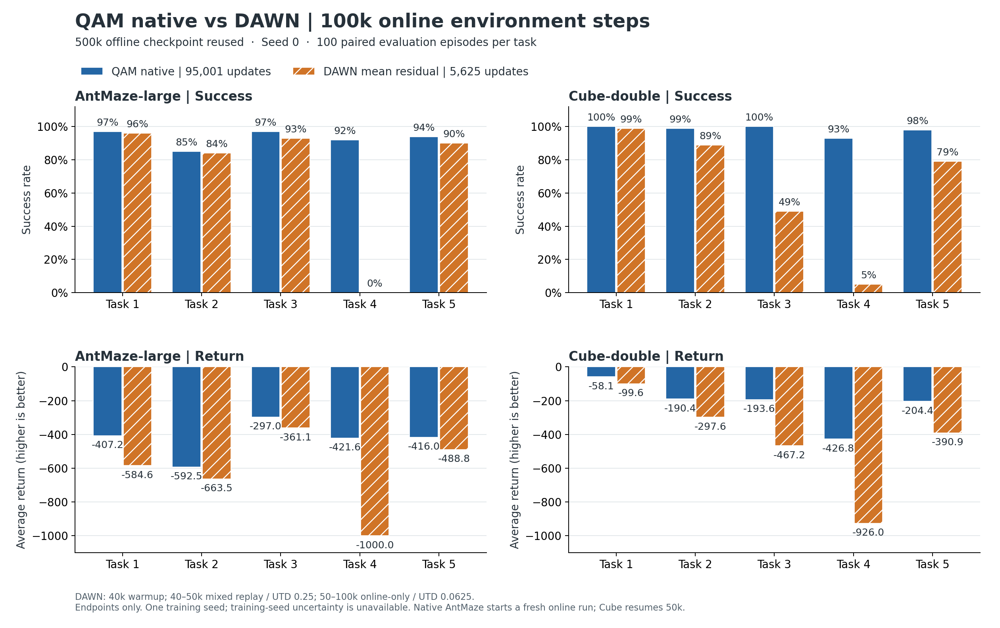

# QAM → DAWN residual RL：AntMaze-large 与 Cube-double

保存两组 OGBench benchmark 各 5 个 task 的实际实验源码、配置与结果。最新一轮为 **500k offline updates + 100k online environment steps**，训练 seed=0；QAM native 和 DAWN 共 20 组，均已完成。

## 最新 100k 设置

| 项目 | QAM native | DAWN residual |
|---|---|---|
| 起点 | 对应 task 的 QAM offline 500k | 同一 offline checkpoint；冻结 base，继承 Q / target Q |
| 0–40k | 5k 起开始在线更新，UTD=1 | base-only rollout，收集 replay，不更新 |
| 40–50k | 原生 QAM replay / UTD=1 | 每批 128 offline + 128 online，UTD=0.25 |
| 50–100k | 原生 QAM replay / UTD=1 | 每批 256 online，UTD=0.0625；保留前期 online 数据 |
| Batch size | 256 | 256 |
| 100k 时 online gradient updates | 95,001 | 5,625 |
| Critic TD | 原生 QAM objective | naive TD，无 target entropy bonus |
| Actor | 原生 QAM 更新 | state + 实际 sampled base action；Gaussian residual |

DAWN：residual scale=0.1，actor 3×256 ReLU，critic ensemble=10，actor-Q / target-Q 均取 minimum；lr=1e-4、tau=0.01、gradient clip=50。Actor entropy 与自动 alpha 保留。完整设定、replay 转换和续训来源见 [100k 协议](scale100k/PROTOCOL.md)。

两种算法都遵循对应 benchmark 的 action chunk：AntMaze horizon=1、inv_temp=10；Cube horizon=5、inv_temp=1。Native 均使用 **QAM，edit_scale=0**。DAWN 为基于 DAWN 的适配实现，不是原论文默认设置的完整复现。

## 当前代码入口

| 内容 | 入口 |
|---|---|
| AntMaze native 100k | [native.py](scale100k/antmaze_native/native.py)、[suite.py](scale100k/antmaze_native/suite.py) |
| AntMaze DAWN 续训至 100k | [dawn_resume.py](scale100k/antmaze/dawn_resume.py)、[dawn_suite.py](scale100k/antmaze/dawn_suite.py) |
| Cube native / DAWN 100k | [run_online.py](scale100k/cube/run_online.py)、[suite.py](scale100k/cube/suite.py) |
| Cube horizon=5 mixed replay | [balanced_replay.py](scale100k/cube/balanced_replay.py) |
| AntMaze 40k warmup / mixed replay | [antmaze_balanced/](antmaze_balanced/) |
| AntMaze 50→60k 与低 UTD 消融 | [antmaze_online60/](antmaze_online60/)、[antmaze_online60_utd00625/](antmaze_online60_utd00625/) |
| 原始 Cube / BC / Policy Decorator / 1M 消融 | 根目录 `run_*.py`、各 `*_PROTOCOL.md`；见 [历史入口说明](docs/README_20260911.md) |
| 来源、目录对应与运行依赖 | [SOURCE_INDEX.md](SOURCE_INDEX.md)、[运行说明](docs/RUNNING_100K.md) |

## 结果与校验

主结果为 **mean residual**：`tanh(mean)`；base action 仍由 flow policy 采样。每个 task 使用 100 个配对评估 episodes。Sampled residual 作为单独口径保存，不能逐点取两者较高值。

| 五任务等权平均 success rate | QAM native | DAWN mean residual |
|---|---:|---:|
| AntMaze-large | 93.0% | 72.6% |
| Cube-double | 98.0% | 64.2% |

[逐 task 结果与限制](reports/100k_20260914/README.md) · [CSV](reports/100k_20260914/all_tasks_comparison.csv) · [PDF](reports/100k_20260914/all_tasks_100k_comparison.pdf)



不需要 GPU 或 checkpoint 即可校验源码、重新计算已保存的结果；在仓库根目录运行：

```bash
python3 tools/verify_sources.py
python3 scale100k/validate_completed.py
# 绘图需要 numpy 与 matplotlib；默认读 reports/100k_20260914/
python3 scale100k/plot_final.py
```

冻结的评估快照、配置、episode 记录、source / checkpoint 哈希已收录，便于复核。仅一个训练 seed，100 个评估 episodes 不代表多训练种子的稳定性；相同 env budget 也不代表相同梯度更新或计算量。

## 环境与运行

训练使用 Linux、NVIDIA GPU、Python 3.10、JAX 0.4.35、OGBench 1.1.0、MuJoCo 3.2.7。Cube 使用原 [requirements.txt](requirements.txt)；AntMaze 的额外依赖见 [requirements-antmaze.txt](requirements-antmaze.txt)。两台机器实际版本保存在 [provenance/20260914/](provenance/20260914/)。

这是经过整理的 **实际训练源码快照**。训练模块保持与服务器字节一致；归档时只修改 README、补充说明和报告工具路径。运行脚本有 checkpoint、源码哈希和历史目录前置检查，因此 clone 后不能直接恢复所有训练。数据、模型、replay、虚拟环境、视频和凭据没有上传；运行前按 [运行说明](docs/RUNNING_100K.md) 准备它们。

AntMaze native 100k 从原 offline 500k 重新开始 online；Cube native 从完整旧 50k 状态续训。AntMaze native 的最终 replay 导出缺少最后一条 transition，且 simulator export 不完整，**不能当作精确续训 checkpoint**；这不影响已验证的 100k endpoint 结果。

QAM 上游固定 commit：`2726d767c9a0a7a46d49693f0391f73dc2cf58ac`。各 `official/` 和 `vendor/qam/` 保留上游 MIT License。原有源码和历史实验未被删除，也未为自有代码额外选择许可证。
